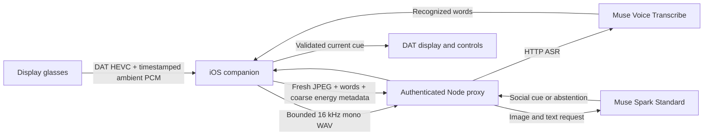

# Aside architecture

Aside is an explicitly started surroundings and conversation aid. Display mode offers one brief social cue from a fresh scene or concrete recognized speech. A library image can support a qualified etiquette cue without speech. An explicit request for space can support a respectful response. There is no face identification, tone/mood inference, diagnosis or sound-event classification.

## Capture modes and responsibilities

`CaptureMode` selects iPhone / regular Meta glasses / Display glasses / explicit simulation. DAT initializes lazily for glasses work. The Xcode project pins **DAT 1.0.0** and compiles all three source folders into one phone companion.

| Mode | Capture | Output |
|---|---|---|
| iPhone | Built-in microphone; optional AVFoundation rear camera | Phone captions and suggestions; pauses when backgrounded |
| Regular Meta glasses | Low-resolution 15 FPS HEVC; explicitly selected HFP microphone | Phone output; spoken output not implemented |
| Display glasses | Low-resolution 2 FPS HEVC and 16 kHz mono ambient PCM in one DAT camera stream | Glasses social cue with optional captions; phone preview/status |
| Simulated demo | Typed speech and synthetic image fixtures | Explicitly simulated cue; no sensor capture |

The phone handles video decoding, JPEG sampling, bounded PCM/WAV batching, transcript state, scheduling and cue validation. Muse performs transcription and image/text inference via an authenticated backend. No model runs on the glasses, and full-video streaming to Muse is not implemented.

`phone-app/ios/Copilot` owns phone capture, bounded audio/transcript state and the API client. `regular-glasses/Sources` owns shared DAT transport and HEVC decoding. `display-glasses/Sources` owns cue-first rendering and serialized sends/clears. `server/index.mjs` exposes only `POST /api/cue` and `POST /api/transcribe`; `server/model.mjs` owns provider credentials/prompts; `server/validation.mjs` validates timestamps, images and WAV. `shared/protocol.mjs` retains the browser conversation policy.

Display audio uses experimental `StreamConfiguration.audioCodec` / `audioFramePublisher`, with DAT camera and microphone permissions plus iOS microphone permission. Camera and Audio Streaming app approval is required for development/beta use; production publishing is unavailable for this capability. Regular glasses retain add camera → select/settle/verify HFP → start video. Both paths use a single `DeviceSession`, and Display is attached to that same session. The [pinned release notes](https://github.com/facebook/meta-wearables-dat-ios/blob/1.0.0/CHANGELOG.md) and [current official audio guide](https://github.com/facebook/meta-wearables-dat-ios/blob/main/plugins/mwdat-ios/skills/audio-streaming/SKILL.md) document the API and access conditions.

Start checks for a reachable live proxy. If it is unreachable or not live, capture still starts in a camera-only state: preview and presence detection work, while ASR and cues wait until **Connect** in Settings succeeds, which re-enables them mid-session.

## Evidence and model contracts

`analysisMode: "surroundings"` selects a separate Spark prompt. It accepts fresh images without requiring speech; normal conversation mode retains speech-grounded behavior. Both use `muse-spark-1.3` image/text Chat Completions, low reasoning effort and a strict five-field schema: `cue`, `reason`, `confidence`, `type`, `should_display`. Types remain `clarify`, `follow_up`, `reminder`, `respond`, `abstain`; simple environmental etiquette uses `reminder`.

Speech goes through `muse-voice-transcribe-1.0` HTTP ASR. Captions represent completed recognized speech, never generated scene narration. A bounded 240-character caption expires after 15 seconds and survives cue dismissal. Captions are optional on the glasses and appear after the social cue. Notes remain wearer-authored; Pause retains them, Stop clears them.

Optional `audioContext` contains source (`glasses_pcm`, `glasses_hfp`, or `phone`), capture timestamp, window length, dBFS energy and activity ratio. This is coarse, uncalibrated capture metadata. It is not dB SPL, speech identity, a sound label or an audible tone. Low energy or missing words does not prove quiet surroundings; energy alone cannot justify a cue. The Spark prompt forbids mood/mental-state inference from faces, voices or behavior. A cue about giving space must be grounded in explicit words or other appropriate current evidence.

The local demo contains library/group scenes and an explicit rough-day/request-for-space line. These are narrow deterministic fixtures, not evidence of Muse accuracy. The browser remains a separately labeled conversation simulator; its optional camera/mic route is a development fallback requiring a live provider. Browser mic capture is per-button six-second chunks and browser hiding pauses capture.

## Scheduling and bounded work

The wearer confirms consent and taps **Start analyzing**. Sensors remain active until Pause or Stop; the phone makes intermittent inference requests instead of uploading every frame. **Analyze now** requests an immediate eligible check. Automatic checking and cue presentation have separate limits:

| Native Display policy | Default |
|---|---:|
| Requested transport frame rate | 2 FPS |
| Local JPEG refresh | Every 2 seconds; one frame retained |
| JPEG size | Maximum dimension 640 pixels; quality 0.6 |
| Inference with recognized speech less than 30 seconds old | 8 seconds |
| Inference without recent recognized speech | 20 seconds |
| Low Power Mode or serious phone thermal state | 30 seconds |
| Critical phone thermal state | Pause capture and analysis |
| Automatic cue cooldown | 30 seconds after display or dismissal |
| Cue lifetime | 8 seconds; expiry does not extend cooldown |
| Current speech evidence | At most 15 seconds old |
| Current image / energy context | At most 10 seconds old when submitted; surroundings image must remain ≤20 seconds at response |
| Delay after recognized speech / session start | At least 1.5 seconds |
| Rolling transcript | 60 seconds, at most 12 entries / 500 characters each |
| Cue confidence / size | At least 0.80; at most 14 words / 90 characters |
| Deduplication | Last 20 normalized cues |
| Cue HTTP timeout / concurrency | 20 seconds / one request; surroundings result age ≤20 seconds, conversation result age ≤10 seconds |
| ASR concurrency | One; overlapping chunks drop |

These are provisional bounds. An automatic request waits for both its inference interval and any cue cooldown; no-cue responses permit subsequent checks at the selected interval. Manual Analyze now bypasses those automatic timing gates, but not consent, active state, completed ASR, fresh evidence or output validation. Speech can affect cadence for 30 seconds while only the last 15 seconds qualifies as current cue evidence. When current speech ages out, surroundings requests omit the old transcript and may use a fresh image alone.

Energy gating batches approximately 1–6 seconds of audio and suppresses silence-only ASR uploads. Steady ambient noise can trigger ASR but is not assumed to be speech. In surroundings mode raw energy callbacks do not reset speech timing or invalidate cues; only actual recognized words do. Empty ASR preserves visual eligibility; failed ASR pauses. This avoids starvation in the presence of fans/music/crowds while preserving fresh speech updates. Phone/regular conversation mode retains its energy-based active-speech gate.

Native conversation mode samples JPEGs every 8 seconds by default, configurable separately. Browser defaults remain 5-second image samples, up to 40 transcript entries / 6,000 characters, and a two-minute dedup window. Do not compare these modes' timings as if their schedules were identical. The proxy caps WAV duration at 20 seconds, request bodies at 1 MB, active operations at two and requests at 60 per minute.

The shared stream clock maps video/audio presentation timestamps to a session time base. HEVC dependencies are decoded off the UI actor; held decoder output is never retimestamped as a new frame. A bounded delivery gate prevents a backlog. New recognized speech, context edits, dismiss, pause, stop and failures invalidate previous cue generations. Response-time evidence freshness is checked again, so a late model result is dropped even if cancellation was too late upstream.

Pause stops camera/audio and clears rolling context while keeping a Display Resume/Stop view. Stop also clears notes/consent, cancels audio listeners, clears Display and ends the session. Resume creates a fresh session deliberately. DAT/system failures invalidate work; there is no reconnect loop or speculative three-minute restart timer.

## People and group profiles

The wearer keeps profiles of individual people and friend groups (`phone-app/ios/Copilot/People.swift`), saved on the phone in `Application Support/people.json` with file protection. A person has groups, tags, topics and notes; a group has topics, slang, a style note (pace, humor, formality) and notes. **Who's here** fills in automatically (`PresenceTracker` in `FaceRecognizer.swift`): two on-device face matches within 10 seconds, a capitalized name heard in speech, or an introduction ("this is my friend Priya", which also creates the profile) adds a person. Face matching uses Vision feature prints of face crops compared against photos enrolled per person; frames are never uploaded for recognition. People drop off after 5 minutes without a face match or mention (2 minutes if only ever named). Long-pressing a name offers **Not here**, which keeps them out until they are introduced again. Voice identification is not implemented.

Each `POST /api/cue` carries the present people and their groups as `people` / `groups`. Both prompts treat them as background memory, not current evidence: use them to suggest topics, follow up on earlier details, and match slang, pace and humor, without assuming who is speaking.

Unlike the rest of the session, recognized speech is also kept in a whole-conversation log (at most 400 entries) until Stop. On Stop, if anyone was detected during the session (including people who have since dropped off), the phone sends that log, the present profiles, their groups, other group names and a measured words-per-minute to `POST /api/learn`. The model proposes new facts, topics, tags and group memberships per person (only when the transcript makes attribution clear) and topics, slang and style per group. The wearer approves each proposal in a review sheet before anything is saved. The log is then discarded. The offline simulated demo and mock server use a narrow fixture learner (name mentions become facts, "I love X" becomes a topic).

## Display and hardware limits

A single root `FlexBox` shows the social cue first, optional captions second, and Analyze now / Dismiss / Pause / Stop controls. Paused Resume is available while the retained display session is usable; initial Start occurs on the phone. Writes and clears are serialized and revision checked. A locally completed clear cannot prove that a disconnected physical display cleared.

Earlier official documentation described dimming after 20 seconds and sleep after 25 seconds. Guaranteed wake-on-new-cue remains unverified. Do not promise an always-on display or send artificial keep-alives. DAT 1.0.0 supports mock Display previews, but neither those nor the app's independent fixtures establish physical readability/wake or sensor quality.

HEVC supports the documented background camera path, but locked-phone audio/decoding/network/display operation still needs a hardware soak. Phone mode deliberately pauses when backgrounded. Regular HFP may suppress nearby speech; direct PCM nearby-speaker quality also needs measurement. Phone Low Power/thermal adaptation does not replace the glasses' own battery/thermal protections; DAT stream errors pause capture.

## Alternatives

| Approach | Status and tradeoff |
|---|---|
| Sampled image + rolling transcript + coarse energy | Implemented; bounded uploads and easy freshness checks, but misses motion/events between images and loses audible tone |
| Short MP4 with synchronized audio | Documented Spark alternative; requires accumulation, encoding/upload and file-lifecycle work; no benefit measured for this cue task |
| Persistent live video/audio socket to Spark | Not established by inspected docs; text SSE is not live-video input |
| Realtime ASR + sampled images | Documented future optimization; adds WebSocket credentials, turn reconciliation and renewal without adding live video reasoning |

See [model research](research-model.md) for provider sources and limits. No alternative is rejected on invented latency or cost.

## Data and validation

The Muse key stays in backend `MUSE_API_KEY`; a separate `COPILOT_PROXY_TOKEN` authenticates clients and lives in native Keychain. Native HTTP is restricted to loopback; physical phones need a trusted HTTPS proxy. The development server does not terminate TLS. Native networking is ephemeral with no URL cache. Infrastructure logging must be configured separately.

Raw audio/video, sampled images and transcript are held in bounded memory rather than saved to app files or content logs. Pause/Stop clear capture context. Local cancellation/deletion cannot recall provider requests already accepted. SDK telemetry opt-outs do not set model retention. Standard Muse terms describe no training on content, but do not imply default zero retention; see dated [model research](research-model.md).

Report ASR/API times, successful JSON upload bytes, returned usage estimates, stale/audio drops and useful/false/distracting cues. Evidence-to-phone-cue-ready timing is not physical display latency. Unknown/canceled-request cost remains unknown. [Hardware acceptance](DEMO.md) covers nearby voices, continuous noise, library scenes without speech, sleep, background operation and thermal behavior. Current build/test results belong in the root README; hardware accuracy, latency, runtime and live price remain unmeasured.
