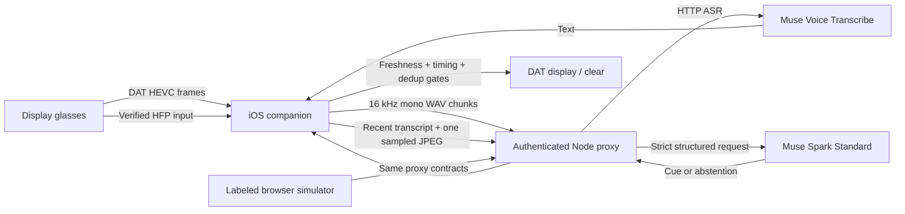

# Aside architecture

Aside is an explicitly started conversation aid. It offers one short cue from concrete recent speech and weak optional visual context. Abstention is the default; it has no face identification, emotion/intent inference, diagnosis, or treatment claims.

## Phone-first extension · 2026-09-25

`CaptureMode` selects iPhone / regular Meta glasses / Display glasses / explicit simulation. `PhoneCamera` uses AVFoundation rear-camera buffers; `ConversationMicrophone` explicitly selects builtInMic or the chosen HFP UID. DAT initializes lazily, only for glasses work. Regular glasses attach camera only; Display glasses attach camera and display. Phone mode pauses on background entry.

Caption state is independent of cue state. Completed real ASR chunks update a bounded 240-character caption, expire after 15 seconds, and survive cue dismissal. Late/out-of-order/expired caption updates are rejected. Suggestions retain the existing silence/freshness/cooldown policy. Wearer-authored notes persist through Pause but clear on Stop. There is no generated scene narration presented as a transcript. True partial streaming ASR and regular-glasses spoken output remain future work. See [reference review](REFERENCE_COMPARISON.md).

## Implemented glasses path

`phone-app/ios/Copilot` contains the native companion, phone camera, selected microphone capture, bounded speech/transcript state and API client. `regular-glasses/Sources` contains shared DAT connection/camera transport and HEVC decoding. `display-glasses/Sources` contains the glasses display rendering and clear operations. The Xcode project compiles all three folders into one companion app. iOS DAT 0.9.0 and a single shared `DeviceSession` are the hardware route. Xcode 26.6 and a registered but offline iPhone were found on this Mac, so iOS was selected over Android. Actual pocket operation has not been established by a build or simulation.

`server/index.mjs` serves the simulator and two task-specific routes: `POST /api/cue` and `POST /api/transcribe`. `server/model.mjs` owns the model credential and Standard-tier provider calls. `server/validation.mjs` checks timestamps, bounds, image signatures and WAV format. `shared/protocol.mjs` defines the wire schema and browser cue policy. `web/` is the development interface and labeled mock-device surface, not an application deployed to the glasses.

The browser **Simulated conversation** source uses typed/scripted fixtures with a mock backend. **Browser camera + manual / mic input** is an explicitly selected live development fallback and requires a live provider for cue requests. Its microphone captures a six-second chunk per button press; it is not a continuous glasses audio loop. Browser hiding pauses capture. The native app separately has local simulated input and a scripted-provider toggle for offline work.

Native **Connection test only (no uploads)** attaches actual glasses camera/display/HFP and permits a manual cue without a backend. It discards speech buffers and disables inference. Full hardware conversation mode requires a reachable live proxy. This keeps the first hardware vertical slice independent of a model credential.

The live cue request uses `muse-spark-1.3` Chat Completions with `strict:true` JSON schema, low reasoning effort and one optional JPEG/PNG. The five fields are `cue`, `reason`, `confidence`, `type`, `should_display`; current type values are `clarify`, `follow_up`, `reminder`, `respond`, `abstain`. Both provider output and local display eligibility are checked. Model confidence is a heuristic signal, not a calibrated probability of correctness.

## Alternative comparison

| Approach | Verified API support | Tradeoffs | Decision |
|---|---|---|---|
| Sampled image + rolling transcript | Image/text Spark requests, strict output, separate ASR | Small bounded requests; easy to drop stale images; speech carries most evidence. Loses motion and can miss a visual event between samples. | **Implemented initial route.** Benchmark before changing frequency. |
| Short MP4 + transcript or embedded audio | Spark video understanding with synchronized soundtrack in uploaded MP4 | More encoding/upload work, clip accumulation delay and file-lifecycle complexity. HFP limitations remain. No extra benefit has been measured for these conversation cues. | Documented supported alternative, not implemented. Avoid persistent Files API uploads by default. |
| Persistent live video + audio to Spark | Not established by inspected current docs | Cannot design against an assumed socket, latency or session limit. Text SSE output does not provide this capability. | Not implemented or claimed. |
| Realtime ASR + sampled images | Dedicated `wss://api.meta.ai/v1/asr/realtime` is documented | Could reduce chunk/turn delay. Adds backend WebSocket credential handling, turn reconciliation, pacing and session renewal; 60-minute ASR session maximum. Does not add live video reasoning. | Supported future optimization after measurements; current prototype uses HTTP ASR chunks. |

Sources, dates, payload details and limits are in [model research](research-model.md). No alternative was rejected on invented latency or cost measurements.

## Lifecycle and bounded work

The user confirms participant consent and starts deliberately. Pause/stop invalidate pending requests and stop capture/cues. Stop clears the session transcript, sampled image and saved session context. Pause clears rolling capture data while saved wearer topics may remain available for deliberate resume. Dismiss invalidates the current cue and gives the conversation space. Device/system pause, route loss, disconnect and new speech also invalidate stale suggestions. Restart is deliberate after user stop or disconnected hardware; a paused SDK session is not repeatedly restarted.

The iOS route first adds the camera, selects/starts the explicit HFP input, allows routing to settle, verifies it, and then starts video. It resamples incoming mono audio to PCM16/16 kHz WAV for ASR. Resampling 8 kHz HFP does not restore lost detail. An energy threshold identifies voice activity; it is provisional and needs calibration. Speech chunks flush after silence or around six seconds of continuous audio. One ASR operation is kept active; overloaded chunks are dropped instead of accumulating a delayed conversation.

The camera stream is distinct from model sampling. HEVC state is decoded off the UI thread; only selected fresh frames become small JPEG uploads. A held decoder image must never be given a fresh capture timestamp. The model never receives every video frame. There is no three-minute restart timer because no corresponding current DAT limit was established.

Current shared defaults are conservative **provisional settings**, not measured optimums:

| Bound/policy | Default |
|---|---:|
| Frame sample interval | 5 seconds |
| Frame maximum age | 10 seconds |
| Rolling transcript | 60 seconds, at most 40 entries / 6,000 characters |
| Speech eligible for a cue | Ended within 15 seconds |
| Natural silence before request | 1.5 seconds |
| Cue confidence threshold | 0.80 |
| Known ASR confidence eligibility | At least 0.65; unknown remains unknown |
| Cue size | At most 14 words / 90 characters |
| Cue lifetime | 8 seconds |
| Automatic cue cooldown | 30 seconds |
| Deduplication history | 2 minutes |
| Cue request deadline | 10 seconds |
| In-flight cue operations | One per client |
| Proxy total active operations | Two; 60 requests/minute overall |
| Proxy request body | At most 1 MB |

Native defaults may be stricter than these shared/proxy bounds: the current companion samples every eight seconds, keeps at most 12 transcript entries, and remembers the last 20 normalized cues for the session. Its sample interval is configurable. These implementation differences should be recorded when comparing benchmark runs rather than treating browser and native timings as interchangeable.

Manual Help may bypass the automatic cooldown, but not consent, connection, freshness, active speech, schema or evidence checks. An empty/unclear transcript cannot be replaced by model speculation. After a new utterance, pause, stop or dismiss, a response from the old generation is discarded even if cancellation reached the provider too late.

The proxy accepts at most 20 seconds of recent PCM16 mono 16 kHz WAV, verifies the RIFF chunks and constrains upload size. It supports no generic arbitrary model endpoint, remote image URL fetching or persistent media collection. A busy, timed-out or invalid request becomes no cue; samples are not queued indefinitely. Failed browser ASR pauses and clears old context; empty ASR also prevents reuse of earlier speech. Pause/Stop abort pending browser ASR, and its microphone remains busy through the transcription response.

## Display and pocket limits

DAT sends a complete root layout, with explicit controls. Updates and clears must be serialized and checked against the current session generation. `clearDisplay()` clears content; ending the experience also stops display before its parent session. A disconnected glasses screen cannot be proven cleared by local state alone.

The display dims at 20 seconds and sleeps at 25 seconds of inactivity without ending the session. Guaranteed wake-on-new-cue was not verified. Respect display sleep; never send artificial keep-alives to defeat it. The demo must check whether stale content is present on wake.

`.hvc1` compressed streaming is the documented background route. That does not establish that audio, software decoding, network calls and display delivery all continue with the phone locked. Thermal/battery errors are explicit stop/degrade conditions, not prompts for an aggressive reconnect loop. HFP also prioritizes wearer speech and suppresses a partner; successful wearer transcription is insufficient evidence for the requested two-person experience.

## Data, credentials and retention

The Muse key stays in the server environment (`MUSE_API_KEY`), never a client build or source file. A separate random `COPILOT_PROXY_TOKEN` authenticates clients and is required for live mode or a non-loopback bind. Native storage uses iOS Keychain with device-only, after-first-unlock accessibility so the token can be available during a locked-phone session. The native network session is ephemeral with no URL cache.

The Node server is plain HTTP and defaults to loopback. A real phone must reach it through a trusted HTTPS reverse proxy or equivalent secured deployment; TLS termination is a setup responsibility, not something the development server implements. Native non-loopback HTTP is rejected. Do not publish an unauthenticated public proxy or put the provider key in browser settings. Reverse-proxy access/body logs and hosting telemetry must be configured separately to avoid capturing tokens or conversation content.

Raw audio, images, transcript and model context are processed in bounded memory rather than intentionally written to application storage or console logs. Pause/stop clear client context and cancel ongoing work. Cancellation and local deletion cannot recall a request already accepted upstream. OS memory, crash behavior and external infrastructure are separate from application-level retention guarantees.

SDK analytics/crash reporting can be opted out independently of model data handling. Use **Standard** Muse, whose Terms say content is not used to train Meta models; **Standard is not a zero-retention service by default**. Service, security, policy review and legal retention can still apply. No account-specific zero-retention agreement was verified. Files API uploads are avoided; their files do not expire automatically. Exact current Wearables bystander/retention terms remained login-gated during research.

## Measurement and acceptance

Measure ASR time, API time, client upload bytes, token usage, estimated token/audio cost, suppressed cues and stale-response drops. Browser byte totals include cue JSON and audio JSON payloads, not transport headers or retransmissions. Missing usage is shown as incomplete instead of a measured zero. Cost totals are estimates from returned usage/audio length, not billing reconciliation: canceled or discarded requests may have incurred upstream work without usable accounting. Keep timestamps for audio/frame capture, request start/end, eligibility, display send and clear. Phone-side send completion is not a measurement of photons on the glasses: physical display timing and successful clearing require hardware observation.

Benchmark with a fixed consented script, then tune only when repeated data warrants it. Report mock timings as mock timings and live-network timings separately. Count incorrect cues and distractions as well as useful cues; a fast wrong cue is a failure. The [demo protocol](DEMO.md) includes clock skew, partner speech, locked-phone and display sleep checks. No hardware accuracy, latency, runtime or per-conversation price is claimed from unrun tests.
